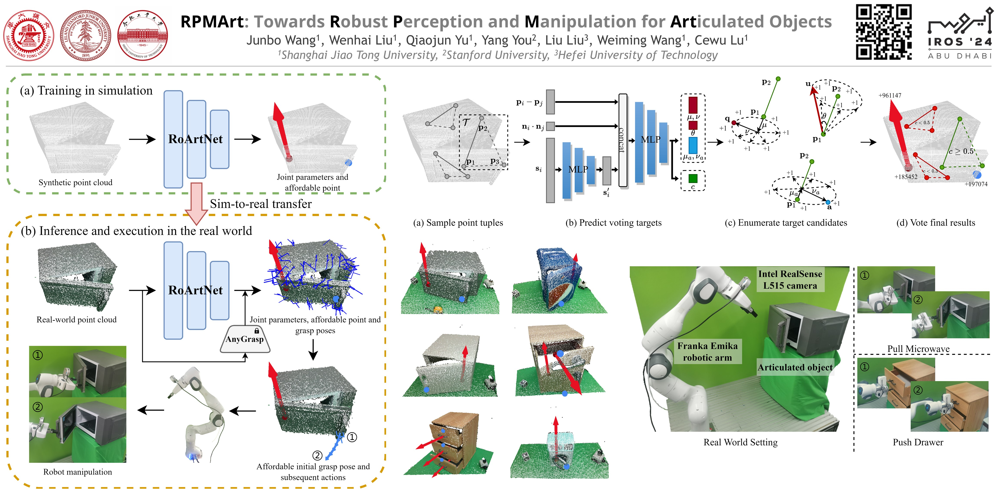

# RPMArt

<a href='https://r-pmart.github.io/'>
  
</a>
<a href='https://arxiv.org/abs/2403.16023'>
  
</a>
<a href='https://iros2024-abudhabi.org'>
  
</a>
<br/>

<!--  -->


Official implementation for the paper [RPMArt: Towards Robust Perception and Manipulation for Articulated Objects](https://arxiv.org/abs/2403.16023), accepted by [IROS 2024](https://iros2024-abudhabi.org).

For more information, please visit our [project website](https://r-pmart.github.io/).

---

## 🛠 Installation
### 💻 Server-side
1. Clone this repo.
    ```bash
    git clone git@github.com:R-PMArt/rpmart.git
    cd rpmart
    ```

2. Create a [Conda](https://conda.org/) environment.
    ```bash
    conda create -n rpmart python=3.8
    conda activate rpmart
    ```

3. Install [PyTorch](https://pytorch.org/).
    ```bash
    pip install torch==1.12.1+cu113 torchvision==0.13.1+cu113 --extra-index-url https://download.pytorch.org/whl/cu113
    ```

4. Install [pytorch-gradual-warmup-lr](https://github.com/ildoonet/pytorch-gradual-warmup-lr).
    ```bash
    cd deps
    git clone git@github.com:ildoonet/pytorch-gradual-warmup-lr.git
    cd pytorch-gradual-warmup-lr
    pip install .
    cd ../..
    ```

5. Install [MinkowskiEngine](https://github.com/NVIDIA/MinkowskiEngine).
    ```bash
    conda install openblas-devel -c anaconda
    export CUDA_HOME=/usr/local/cuda
    pip install ninja
    cd deps
    git clone git@github.com:NVIDIA/MinkowskiEngine.git
    cd MinkowskiEngine
    pip install -U . --no-deps --install-option="--blas_include_dirs=${CONDA_PREFIX}/include" --install-option="--blas=openblas"
    cd ../..
    ```

6. Install [CuPy](https://cupy.dev/).
   ```bash
   pip install cupy-cuda11x
   ```

7. Install special [SAPIEN](https://sapien.ucsd.edu/).
    ```bash
    pip install http://download.cs.stanford.edu/orion/where2act/where2act_sapien_wheels/sapien-0.8.0.dev0-cp38-cp38-manylinux2014_x86_64.whl
    ```

8. Install [AnyGrasp](https://github.com/graspnet/anygrasp_sdk).
    ```bash
    pip install cvxopt munch graspnetAPI
    # follow AnyGrasp to use the licenses and weights and binary codes
    ```

9.  Install other dependencies.
    ```bash
    pip install -r requirements.txt
    ```

10. Build `shot`.
    ```bash
    # you may need first install pybind11 and pcl
    cd src_shot
    mkdir build
    cd build
    cmake ..
    make
    cd ../..
    ```

### 🦾 Robot-side
1. Make sure `rt-linux` is enabled for Franka Emika Panda.
    ```bash
    uname -a
    ```

2. Install `frankx` for robot and `pyrealsense2` for camera.
    ```bash
    pip install frankx pyrealsense2
    ```

3. Install `paramiko` for connecting with server.
    ```bash
    pip install paramiko
    ```

## 🏃‍♂️ Run
1. Train or download [RoArtNet](https://huggingface.co/dadadadawjb/RoArtNet).
    ```bash
    bash scripts/train.sh
    ```

2. Test RoArtNet.
    ```bash
    bash scripts/test.sh
    ```

3. Evaluate RPMArt.
    ```bash
    bash scripts/eval_roartnet.sh
    ```

4. Test RoArtNet on [RealArt-6](https://huggingface.co/datasets/dadadadawjb/RealArt-6).
    ```bash
    bash scripts/test_real.sh
    ```

5. Evaluate RPMArt in the real world.
    ```bash
    # server side
    bash scripts/real_service.sh
    
    # robot side
    python real_eval.py
    ```

## 🙏 Acknowledgement
* Our simulation environment is adapted from [VAT-Mart](https://github.com/warshallrho/VAT-Mart).
* Our voting module is adapted from [CPPF](https://github.com/qq456cvb/CPPF) and [CPPF++](https://github.com/qq456cvb/CPPF2).

## ✍ Citation
If you find our work useful, please consider citing: 
```bibtex
@inproceedings{wang2024rpmart,
  title={RPMArt: Towards Robust Perception and Manipulation for Articulated Objects},
  author={Wang, Junbo and Liu, Wenhai and Yu, Qiaojun and You, Yang and Liu, Liu and Wang, Weiming and Lu, Cewu},
  booktitle={2024 IEEE/RSJ International Conference on Intelligent Robots and Systems (IROS)},
  year={2024},
  pages={7270-7277},
  doi={10.1109/IROS58592.2024.10802368}
}
```

## 📃 License
This repository is released under the [MIT](https://mit-license.org/) license.
